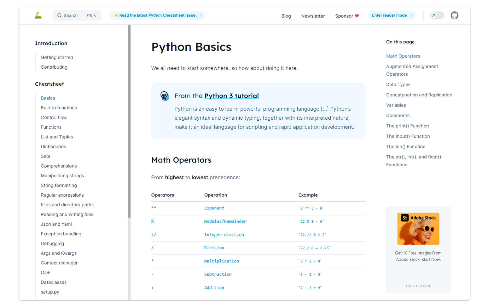

🔥 Cyber Monday 2025 - Ends Soon!｜[**Get 40% OFF Now →**](https://labex.io/pricing)

---

<h1 align="center">Python Cheatsheet</h1>

  <a href="https://pythoncheatsheet.org/">pythoncheatsheet.org</a> |
  <a href="https://github.com/labex-labs/python-cheatsheet/blob/master/src/pages/contributing.md">Contribute</a> |
  <a href="https://github.com/labex-labs/python-cheatsheet/blob/master/src/pages/changelog.md">Changelog</a>

Python Cheatsheet is a comprehensive reference guide for Python developers of all skill levels. Based on the book [Automate the Boring Stuff with Python](https://automatetheboringstuff.com/) and many other sources, this cheatsheet provides a quick reference for common Python tasks and concepts.

Anyone can forget how to make character classes for a regex, slice a list, or do a for loop. This Python cheatsheet tries to provide basic reference for beginner and advanced developers, lower the entry barrier for newcomers and help veterans refresh the old tricks.

## Features

- **Comprehensive Coverage**: From basics to advanced topics including built-in functions, control flow, data structures, and more
- **Built-in Functions Reference**: Detailed documentation for all Python built-in functions
- **Module Documentation**: Guides for popular Python modules like `datetime`, `json`, `pathlib`, `itertools`, and more
- **Blog Articles**: In-depth articles about Python and its ecosystem
- **Easy Navigation**: Well-organized sections with clear examples and explanations
- **Dark Mode Support**: Beautiful UI with light and dark themes

## Quick Links

- **[View on GitHub](https://github.com/labex-labs/python-cheatsheet)**: Drop a star on GitHub if you find this project useful
- **[Contribute](https://pythoncheatsheet.org/contributing)**: Get to know how easy it is to contribute to the Python Cheatsheet
- **[Blog](https://pythoncheatsheet.org/blog)**: Read detailed articles about Python and its ecosystem
- **[Changelog](https://pythoncheatsheet.org/changelog)**: See what is new, what got fixed, and what is coming

## Contributing

Contributions are welcome! Please see the [Contributing Guide](https://pythoncheatsheet.org/contributing) for details on how to get started.

## License

Content is licensed under [MIT](https://opensource.org/licenses/MIT) and maintained by the [LabEx](https://labex.io/) team.

## More Cheatsheets

- [Ansible Cheatsheet](https://labex.io/cheatsheets/ansible)
- [C Programming Cheatsheet](https://labex.io/cheatsheets/c-programming)
- [Comptia Cheatsheet](https://labex.io/cheatsheets/comptia)
- [C++ Cheatsheet](https://labex.io/cheatsheets/cpp)
- [CSS Cheatsheet](https://labex.io/cheatsheets/css)
- [Cybersecurity Cheatsheet](https://labex.io/cheatsheets/cybersecurity)
- [Database Cheatsheet](https://labex.io/cheatsheets/database)
- [Data Science Cheatsheet](https://labex.io/cheatsheets/datascience)
- [DevOps Cheatsheet](https://labex.io/cheatsheets/devops)
- [Docker Cheatsheet](https://labex.io/cheatsheets/docker)
- [Git Cheatsheet](https://labex.io/cheatsheets/git)
- [Go Cheatsheet](https://labex.io/cheatsheets/golang)
- [HTML Cheatsheet](https://labex.io/cheatsheets/html)
- [Hydra Cheatsheet](https://labex.io/cheatsheets/hydra)
- [Java Cheatsheet](https://labex.io/cheatsheets/java)
- [JavaScript Cheatsheet](https://labex.io/cheatsheets/javascript)
- [Jenkins Cheatsheet](https://labex.io/cheatsheets/jenkins)
- [Kali Cheatsheet](https://labex.io/cheatsheets/kali)
- [Kubernetes Cheatsheet](https://labex.io/cheatsheets/kubernetes)
- [Linux Cheatsheet](https://labex.io/cheatsheets/linux)
- [Matplotlib Cheatsheet](https://labex.io/cheatsheets/matplotlib)
- [MongoDB Cheatsheet](https://labex.io/cheatsheets/mongodb)
- [MySQL Cheatsheet](https://labex.io/cheatsheets/mysql)
- [Nmap Cheatsheet](https://labex.io/cheatsheets/nmap)
- [NumPy Cheatsheet](https://labex.io/cheatsheets/numpy)
- [Pandas Cheatsheet](https://labex.io/cheatsheets/pandas)
- [PostgreSQL Cheatsheet](https://labex.io/cheatsheets/postgresql)
- [Python Cheatsheet](https://labex.io/cheatsheets/python)
- [React Cheatsheet](https://labex.io/cheatsheets/react)
- [Redis Cheatsheet](https://labex.io/cheatsheets/redis)
- [RHEL Cheatsheet](https://labex.io/cheatsheets/rhel)
- [Shell Cheatsheet](https://labex.io/cheatsheets/shell)
- [Scikit-learn Cheatsheet](https://labex.io/cheatsheets/sklearn)
- [SQLite Cheatsheet](https://labex.io/cheatsheets/sqlite)
- [Web Development Cheatsheet](https://labex.io/cheatsheets/web-development)
- [Wireshark Cheatsheet](https://labex.io/cheatsheets/wireshark)
